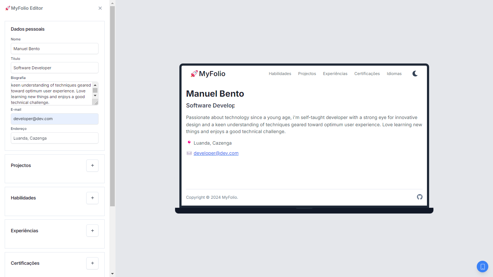

# MyFolio
 


**MyFolio** é um projeto que permite criar portfólios personalizados sem precisar de habilidades de codificação. Com uma interface intuitiva, você pode facilmente montar um site profissional, adicionar seu trabalho e destacar suas habilidades de forma rápida e simples. Ideal para quem busca uma solução prática e elegante para exibir sua criatividade.

## 🛠️ Tecnologias Utilizadas
- Next.js
- React.js
- TailwindCSS
- Zod
- React Hook Form
- Hook Resolver
- React Icons

## 🚀 Começando

### 1. Clonar o Repositório

Clone este repositório para sua máquina local:

```bash
git clone https://github.com/manuelbento19/my-folio.git
cd my-folio
```

### 2. Instalar Dependências

Instale as dependências do projeto com npm ou yarn:

```bash
npm install
```

ou

```bash
yarn install
```

### 3. Executar o Projeto

Para iniciar o servidor de desenvolvimento, use o comando:

```bash
npm start
```

ou

```bash
yarn start
```

Abra seu navegador e vá para `http://localhost:3000` para ver o aplicativo em ação.

## 🤝 Contribuindo

Contribuições são bem-vindas! Se você deseja contribuir para o projeto, por favor, abra um pull request ou envie um problema (issue) para discussão.

## 📝 Licença

Este projeto está licenciado sob a [MIT License](LICENSE).